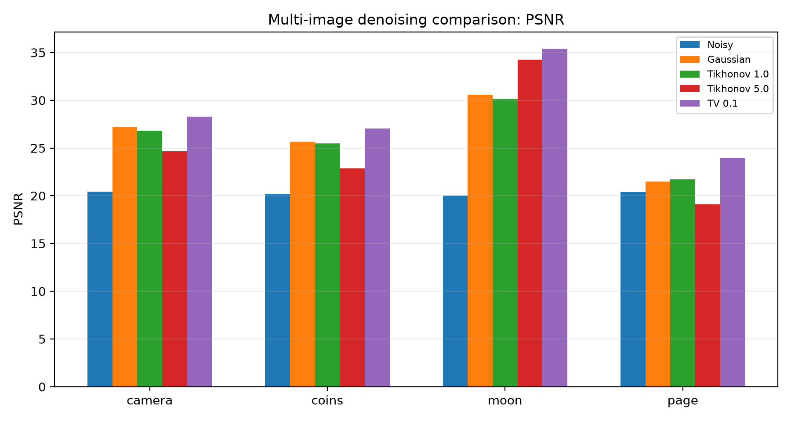
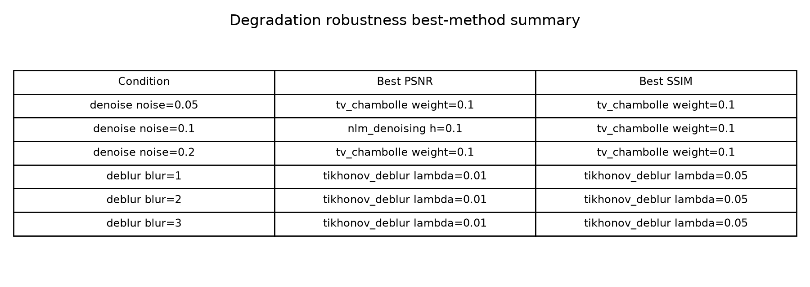
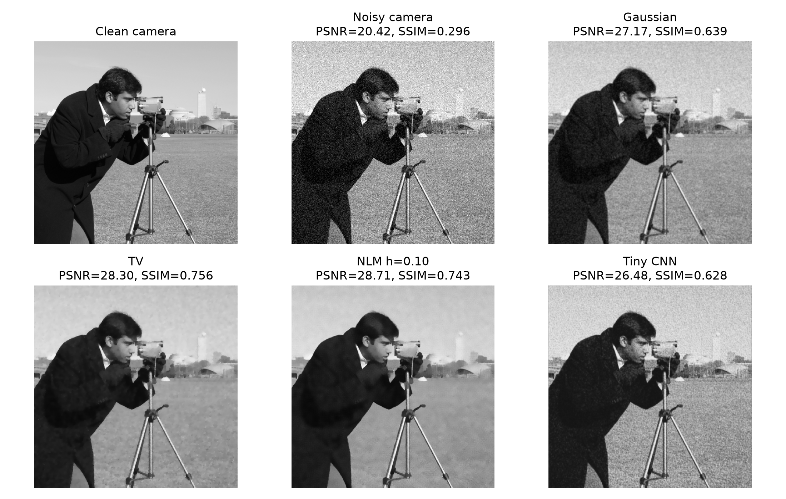

# Image Inverse Problems: Denoising and Deblurring

## Overview

This repository is a reproducible computational study of image denoising and
deblurring using classical filtering, variational regularization, non-local
patch-based methods, frequency-domain deconvolution, iterative deconvolution,
degradation robustness analysis, and a lightweight CNN denoising baseline.

The project studies two representative image inverse problems:

- **Denoising:** recover a clean image from a noisy observation.
- **Deblurring:** recover a sharp image from a blurred and noisy observation.

The work is an undergraduate research-training project, not a claim of a new
algorithm or state-of-the-art performance. Its main contribution is a clear,
reproducible comparison of method behavior, parameter sensitivity, robustness,
reconstruction quality, and computational cost.

## Project Motivation

Image inverse problems are difficult because observations lose or corrupt
information about the unknown clean image. Denoising suppresses random
fluctuations, while deblurring must also reverse an image formation operator
that weakens edges and fine details. Regularization and image priors make these
recovery problems more stable by balancing fidelity to the observation with
assumptions about plausible images.

This project develops the comparison incrementally: it begins with a Gaussian
filter, adds optimization-based and non-local methods, studies deconvolution,
checks multiple images and degradation strengths, and concludes with a small
CPU-friendly CNN baseline.

## Method Taxonomy

| Category | Method | Task | Role in project |
|---|---|---|---|
| Local filtering | Gaussian filter | Denoising | Fast smoothing baseline |
| Variational regularization | Tikhonov | Denoising / Deblurring | Smoothness-regularized baseline |
| Edge-preserving regularization | TV Chambolle | Denoising | Strong edge-preserving baseline |
| Non-local patch prior | Non-local Means | Denoising | Patch-similarity baseline |
| Frequency-domain deconvolution | Wiener | Deblurring | Stabilized inverse filtering baseline |
| Iterative deconvolution | Richardson-Lucy | Deblurring | Iterative deconvolution baseline |
| Learning-based baseline | Tiny CNN | Denoising | Lightweight learned denoiser |

## Repository Structure

```text
image-inverse-problems/
|-- README.md
|-- PROJECT_SUMMARY.md
|-- requirements.txt
|-- LICENSE
|-- src/                 # Reproducible experiment scripts
|-- data/sample_images/  # Saved clean and degraded sample images
|-- results/             # CSV metrics, training history, and metadata
|-- figures/             # Quantitative plots and visual comparisons
|-- models/              # Saved Tiny CNN model
|-- report/              # Mini research report
|-- docs/                # Experiment, result, and figure indexes
`-- notebooks/           # Reserved for exploratory work
```

Detailed navigation is available in
[Experiment Index](docs/EXPERIMENT_INDEX.md),
[Results Index](docs/RESULTS_INDEX.md), and
[Figure Index](docs/FIGURE_INDEX.md). The complete narrative is in
[report/mini_report.md](report/mini_report.md).

## Experiments and Version History

| Version | Focus |
|---|---|
| v0.1 | Single-image denoising and deblurring study |
| v0.2 | Multi-image denoising robustness |
| v0.3 | Wiener deblurring baseline |
| v0.4 | Multi-image deblurring robustness |
| v0.5 | Non-local Means single-image denoising |
| v0.6 | Multi-image NLM denoising robustness |
| v0.7 | Richardson-Lucy deblurring baseline |
| v0.8 | Degradation robustness study |
| v0.9 | Tiny CNN denoising baseline |
| v1.0 | Final polished project |

The numbered outputs `01` through `16` preserve the experimental progression.
The robustness studies include both multiple standard images and multiple
noise or blur strengths. Fixed parameters are used where the goal is to test
transferability rather than tune each condition independently.

## Key Findings

1. TV denoising is a strong and stable classical baseline, especially by SSIM
   and under stronger noise.
2. Non-local Means can achieve strong PSNR and competitive SSIM, but its
   performance depends on `h`, image type, and degradation strength.
3. Tikhonov deblurring is the most stable deblurring method in the tested
   synthetic Gaussian blur settings. The PSNR- and SSIM-optimal regularization
   parameters are not always the same.
4. Wiener deconvolution is competitive but is not consistently best in the
   fixed settings.
5. Richardson-Lucy improves some structural metrics over the blurred noisy
   observation, but it is sensitive to iteration count and does not outperform
   the selected Tikhonov or Wiener baselines.
6. Denoising rankings change with noise strength, while deblurring rankings
   are more stable in the tested degradation grid.
7. The Tiny CNN improves clearly over the noisy image, but it does not
   outperform the stronger classical baselines in this small CPU-friendly
   experiment. More complexity does not automatically produce better results.

PSNR, SSIM, runtime, and visual inspection are reported together because no
single metric completely describes restoration quality.

## Reproducing the Experiments

Create a project-local environment and install the dependencies:

```powershell
py -m venv .venv
.\.venv\Scripts\python.exe -m pip install --upgrade pip
.\.venv\Scripts\python.exe -m pip install -r requirements.txt
```

Run the main experiments from the project root in numbered order:

```powershell
.\.venv\Scripts\python.exe src\mvp_denoising.py
.\.venv\Scripts\python.exe src\noise_sensitivity.py
.\.venv\Scripts\python.exe src\filter_sigma_sensitivity.py
.\.venv\Scripts\python.exe src\tikhonov_denoising.py
.\.venv\Scripts\python.exe src\tikhonov_lambda_extended.py
.\.venv\Scripts\python.exe src\tv_denoising.py
.\.venv\Scripts\python.exe src\consolidated_denoising_comparison.py
.\.venv\Scripts\python.exe src\tikhonov_deblurring.py
.\.venv\Scripts\python.exe src\multi_image_denoising_comparison.py
.\.venv\Scripts\python.exe src\wiener_deblurring.py
.\.venv\Scripts\python.exe src\multi_image_deblurring_comparison.py
.\.venv\Scripts\python.exe src\nlm_denoising.py
.\.venv\Scripts\python.exe src\multi_image_nlm_denoising_comparison.py
.\.venv\Scripts\python.exe src\richardson_lucy_deblurring.py
.\.venv\Scripts\python.exe src\degradation_robustness_study.py
.\.venv\Scripts\python.exe src\tiny_cnn_denoising.py
```

Each experiment uses fixed seeds where randomness is involved. Scripts save
tables and metadata in `results/`, visual outputs in `figures/`, and the Tiny
CNN checkpoint in `models/16_tiny_cnn_denoising.pt`.

## Results and Figures

The main consolidated denoising comparison is stored in
`results/07_consolidated_denoising_comparison.csv`. The multi-image and
degradation-strength studies are stored under prefixes `09`, `11`, `13`, and
`15`. The Tiny CNN metrics, training history, and metadata use prefix `16`.

Representative outputs:








See [docs/RESULTS_INDEX.md](docs/RESULTS_INDEX.md) and
[docs/FIGURE_INDEX.md](docs/FIGURE_INDEX.md) for the complete output map.

## Limitations

- The degradations are synthetic Gaussian noise and Gaussian blur.
- Only a small set of standard grayscale images is used.
- Robustness studies use fixed parameters and do not tune every method for
  every image or degradation level.
- The project does not include real-world datasets, blind restoration, motion
  blur, or alternative boundary models.
- The Tiny CNN is intentionally small, trained on limited data, and is not
  representative of modern large-scale deep learning restoration systems.
- Runtime values are machine- and implementation-dependent.

## Future Directions

- Evaluate on broader and real-world image datasets.
- Study non-Gaussian noise, motion blur, and unknown blur kernels.
- Compare additional boundary conditions and blind restoration methods.
- Train stronger learning-based models with larger datasets while retaining
  the same reproducible evaluation framework.
- Add uncertainty analysis or repeated-run runtime summaries.

## License

This project is released under the [MIT License](LICENSE).
