# Optimization-Based and Regularization-Based Methods for Image Inverse Problems: A Reproducible Study

## Abstract

This report presents a reproducible computational mini-project on image inverse problems, focusing on image denoising and deblurring. The project studies how simple filtering and regularization-based methods recover a clean image from degraded observations. For denoising, Gaussian filtering, Tikhonov regularization, and Total Variation (TV) denoising are compared under controlled Gaussian noise. For deblurring, an FFT-based Tikhonov method is tested on images degraded by Gaussian blur and additive noise. The experiments are implemented in Python and evaluated using PSNR, SSIM, runtime, and visual comparisons. The denoising results show that Gaussian filtering is a strong and very fast baseline, while TV denoising achieves the best reconstruction quality in the tested setting. Tikhonov regularization provides an interpretable optimization-based formulation and illustrates the role of parameter sensitivity. The deblurring results show that Tikhonov regularization can improve blurred noisy observations, but weak regularization may amplify noise and artifacts. This work is intended as a reproducible research-training project rather than a novel algorithmic contribution.

## 1. Introduction

Image inverse problems arise when the goal is to estimate an unknown clean image from an observed degraded image. In many imaging systems, the measured image is not an exact copy of the underlying scene. It may be corrupted by sensor noise, optical blur, motion blur, compression artifacts, or incomplete measurements. The mathematical task is therefore to recover a plausible image from imperfect data.

This project studies two fundamental examples: denoising and deblurring. In denoising, the observed image is modeled as a clean image plus random noise. This is a natural starting point because the degradation is easy to simulate and the recovery task can be evaluated directly against the known clean image. In deblurring, the image is first transformed by a blur operator and then corrupted by noise. Deblurring is more challenging because blur weakens or removes high-frequency information such as edges and fine details. A naive inverse operation can therefore become unstable.

Regularization is a central tool for stabilizing inverse problems. It introduces prior assumptions about the desired reconstruction, such as smoothness or edge preservation. This project compares three types of methods: a simple Gaussian filtering baseline, Tikhonov regularization, and Total Variation denoising. These methods are not presented as new algorithms. Instead, they are used to build a small but organized computational study showing how mathematical models, numerical methods, parameter choices, and evaluation metrics interact in image restoration.

The main goal of the project is reproducibility. Each experiment produces saved figures, CSV result tables, and clear comparisons using PSNR, SSIM, runtime, and visual inspection. The project is designed as a research-training exercise suitable for developing practical experience in applied mathematics, scientific computing, optimization, and image processing.

## 2. Problem Formulation

For image denoising, the observation model is

```text
b = x + noise
```

where `x` denotes the clean image, `b` denotes the noisy observation, and `noise` denotes additive Gaussian noise. The goal is to construct an estimate of `x` using only the degraded observation `b`.

For image deblurring, the observation model is

```text
b = Kx + noise
```

where `K` is a blur operator. In this setting, the degradation is more severe because the operator `K` mixes neighboring pixel values and suppresses high-frequency image information. The recovery task is to estimate `x` from a blurred and noisy observation `b`.

The experiments use three main evaluation criteria. PSNR measures pixel-wise reconstruction quality and is derived from the mean squared error between the reconstruction and the clean image. A higher PSNR value indicates a smaller pixel-wise error. SSIM measures structural similarity and is designed to capture changes in image structure, contrast, and luminance. A higher SSIM value indicates stronger structural similarity to the clean image. Runtime measures the computational cost of the restoration method.

These metrics are complementary. PSNR may favor images with smaller pixel-wise errors, while SSIM may favor images that preserve visually meaningful structure. As shown in several experiments below, the best parameter according to PSNR is not always the best parameter according to SSIM.

## 3. Methods

### 3.1 Gaussian Filtering

Gaussian filtering is used as a simple smoothing baseline for denoising. The method replaces each pixel by a weighted average of nearby pixels, where closer pixels receive larger weights. This local averaging suppresses random fluctuations and often improves noisy images.

The key parameter is `filter_sigma`, which controls the spatial scale of smoothing. A small `filter_sigma` applies weak smoothing and may leave noise in the image. A large `filter_sigma` applies stronger smoothing but may blur edges, textures, and fine details.

Gaussian filtering is not formulated here as an explicit inverse problem solver. Its role is to provide a fast and interpretable baseline. Because it is simple and computationally cheap, it is useful for judging whether more mathematical methods actually provide a meaningful improvement.

### 3.2 Tikhonov Regularization for Denoising

Tikhonov denoising formulates image recovery as an optimization problem:

```text
min_x 0.5 * ||x - b||_2^2 + 0.5 * lambda * ||grad x||_2^2
```

The first term is the data fidelity term. It encourages the reconstructed image `x` to remain close to the noisy observation `b`. The second term is the regularization term. It penalizes large image gradients and therefore encourages smoothness. The parameter `lambda` controls the trade-off between these two goals.

When `lambda` is too small, the reconstruction remains close to the noisy image and may contain significant residual noise. When `lambda` is too large, the reconstruction becomes smoother but may lose edges and fine details. Thus, Tikhonov regularization makes the parameter trade-off explicit.

The implementation uses an FFT-based solver with periodic boundary conditions. This is computationally efficient and appropriate for a first reproducible implementation, although the periodic boundary assumption is a simplification that may introduce boundary artifacts.

### 3.3 Total Variation Denoising

Total Variation denoising is based on the conceptual model

```text
min_x 0.5 * ||x - b||_2^2 + lambda * ||grad x||_1
```

Like Tikhonov regularization, TV denoising balances fidelity to the noisy observation with a regularization term. The key difference is that TV uses an `L1`-type penalty on the image gradient instead of a squared `L2` penalty. This makes TV more edge-preserving: it tends to remove small oscillatory noise while allowing sharper jumps at important edges.

In the implementation, the `scikit-image` function `denoise_tv_chambolle` is used. Its regularization parameter is called `weight`. A larger `weight` produces stronger denoising, but if the value is too large, the image can become over-smoothed or cartoon-like, with piecewise-constant regions and reduced texture.

TV denoising is especially relevant for image inverse problems because it illustrates a different type of prior assumption. Instead of simply assuming smoothness everywhere, it favors images that are mostly smooth but may contain sharp edges.

### 3.4 Non-local Means Denoising

Non-local Means (NLM) is a patch-based non-local denoising method. Instead of smoothing only nearby pixels, it compares small image patches and gives larger weights to pixels whose surrounding patches are similar. This makes NLM different from Gaussian filtering, which is purely local, and from Tikhonov or TV denoising, which are variational regularization methods.

The main parameter is `h`, which controls filtering strength. Smaller `h` values are more conservative and may leave residual noise. Larger `h` values perform stronger averaging but may blur details. In this project, NLM provides a non-local image prior baseline for denoising.

### 3.5 Tikhonov Deblurring

For deblurring, the Tikhonov model becomes

```text
min_x 0.5 * ||Kx - b||_2^2 + 0.5 * lambda * ||grad x||_2^2
```

Here, the data fidelity term is different from denoising. It does not require the reconstruction `x` itself to look like the blurred observation `b`. Instead, it requires that applying the blur operator `K` to the reconstruction should reproduce the observation. This is the core inverse problem structure: the unknown clean image is estimated indirectly through the degradation model.

Deblurring is more unstable than denoising because blur suppresses high-frequency components. If regularization is too weak, the numerical inverse may amplify noise and produce ringing artifacts. If regularization is too strong, the reconstruction may remain overly smooth. The parameter `lambda` again controls the balance between aggressive inversion and stability.

The deblurring implementation also uses an FFT-based solver with periodic boundary conditions. The blur operator is represented in the frequency domain, and Tikhonov regularization stabilizes the division by small frequency components.

### 3.6 Wiener Deconvolution

Wiener deconvolution is a frequency-domain regularized inverse filter for deblurring. Direct inverse filtering is unstable when the blur operator has very small frequency components, because dividing by those values can strongly amplify noise. The Wiener formulation stabilizes this process by adding a positive `balance` parameter in the denominator of the inverse filter.

In this project, Wiener deconvolution provides a classical baseline for deblurring. Smaller `balance` values apply more aggressive deblurring but may introduce noise amplification and ringing artifacts. Larger `balance` values are more conservative and stable, but they may leave more residual blur.

### 3.7 Richardson-Lucy Deblurring

Richardson-Lucy deblurring is a classic iterative deconvolution method. It starts from an initial image estimate and repeatedly updates that estimate using the mismatch between the observed blurred image and the currently reblurred estimate. The parameter `num_iter` controls the number of update steps.

Too few iterations may under-restore the image, while too many iterations may amplify noise or artifacts. In this project, Richardson-Lucy provides an iterative deblurring baseline that complements Tikhonov regularization and Wiener deconvolution.

## 4. Experimental Setup

All experiments use the built-in grayscale image `skimage.data.camera()`. Pixel values are converted to floating-point values in `[0, 1]`. Randomness is controlled by fixed seeds to make the results reproducible.

For denoising experiments, Gaussian noise is added with

```text
noise_sigma = 0.10
random seed = 42
```

For deblurring experiments, a Gaussian blur kernel is used with

```text
blur_sigma = 2.0
noise_sigma = 0.01
random seed = 42
```

Each experiment saves quantitative results to CSV files and visual results to figure files. The main quantitative metrics are PSNR, SSIM, and runtime. Visual comparisons and error maps are also used because image restoration quality cannot be fully understood from scalar metrics alone.

## 5. Results

### 5.1 MVP Denoising Baseline

The first experiment compares the noisy image with a Gaussian-filtered image.

| Method | PSNR | SSIM | Runtime seconds |
|---|---:|---:|---:|
| Noisy image | 20.421019 | 0.296393 | 0.000000 |
| Gaussian filter | 27.171126 | 0.638713 | 0.006478 |

Gaussian filtering substantially improves both PSNR and SSIM compared with the noisy image. This confirms that simple smoothing can remove a meaningful amount of additive Gaussian noise. However, visual inspection shows that the restored image is also smoother than the original, especially near edges and fine details. This motivates the study of regularization-based methods.

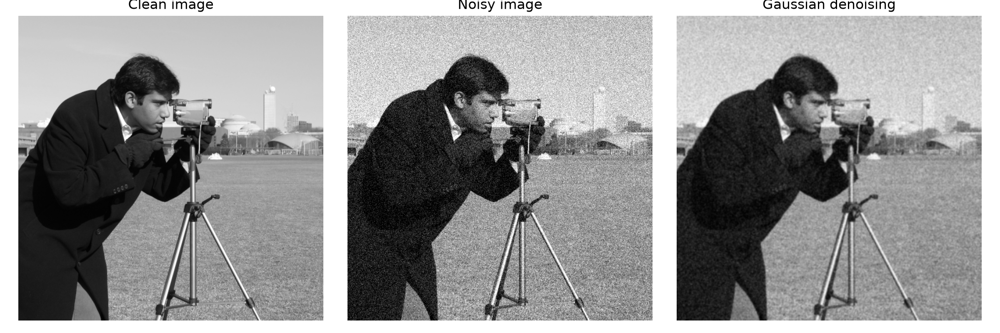

### 5.2 Sensitivity Analysis

Two sensitivity experiments were performed for the Gaussian filtering baseline. The first varied the noise level while keeping `filter_sigma = 1.0` fixed. The tested noise levels were `noise_sigma = 0.05, 0.10, 0.15, 0.20`. As the noise level increases, the quality of the noisy image decreases. Gaussian filtering improves the metrics at all tested noise levels, but the final reconstruction quality still becomes worse under stronger noise. This shows that smoothing helps but cannot fully recover information lost under severe noise.

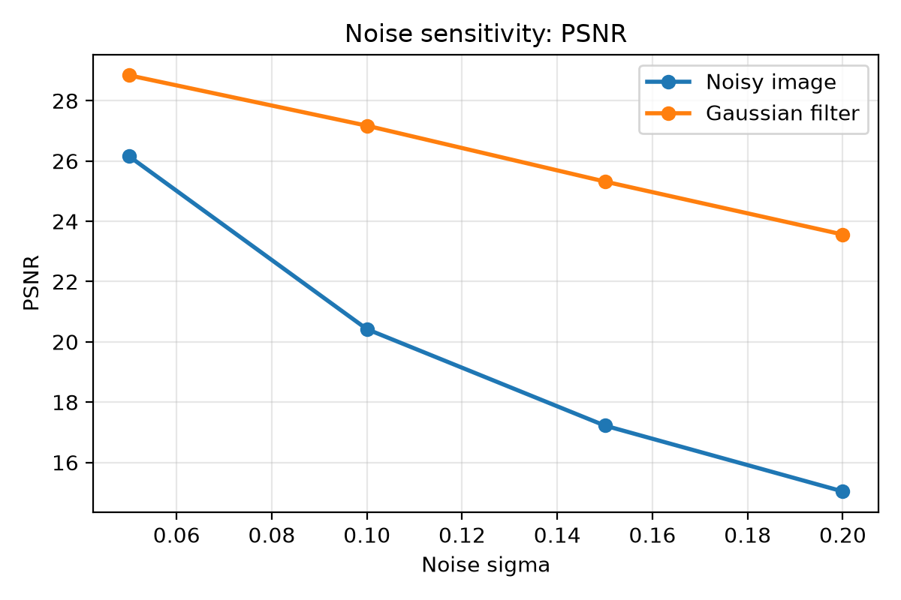

The second sensitivity experiment fixed `noise_sigma = 0.10` and varied `filter_sigma = 0.25, 0.5, 1.0, 1.5, 2.0, 3.0`. The PSNR optimum occurs at `filter_sigma = 1.0`, while the SSIM optimum occurs at `filter_sigma = 2.0`. This difference shows that parameter selection depends on the evaluation metric. A parameter value that minimizes pixel-wise error may not be the same value that maximizes structural similarity.

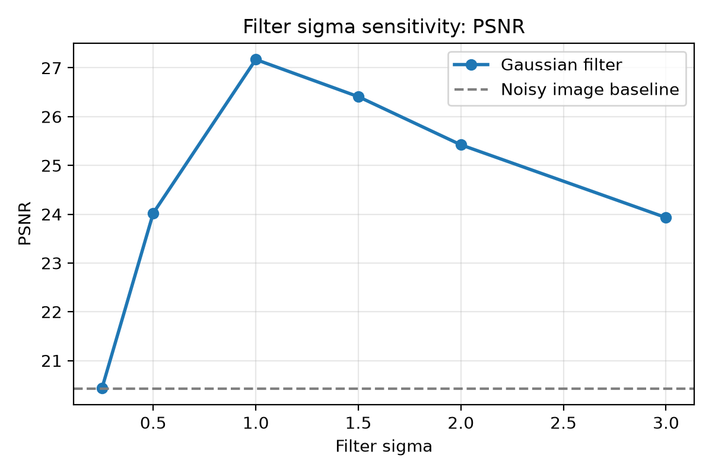

The Tikhonov denoising lambda sensitivity experiment shows a similar pattern: parameter choice strongly affects performance. Small `lambda` values provide insufficient smoothing, while very large values can over-smooth the reconstruction.

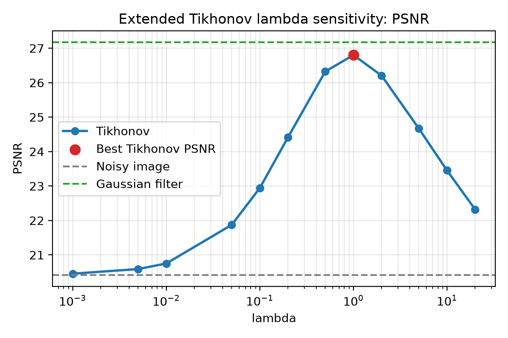

### 5.3 Consolidated Denoising Comparison

The main denoising methods were compared under the same setting: the same clean image, the same Gaussian noise level, and the same random seed.

| Method | Parameter | PSNR | SSIM | Runtime seconds |
|---|---:|---:|---:|---:|
| Noisy image | - | 20.421019 | 0.296393 | 0.000000 |
| Gaussian filter | filter_sigma = 1.0 | 27.171126 | 0.638713 | 0.004875 |
| Tikhonov | lambda = 1.0 | 26.801759 | 0.622013 | 0.018835 |
| Tikhonov | lambda = 5.0 | 24.668893 | 0.689946 | 0.016929 |
| TV Chambolle | weight = 0.1 | 28.302925 | 0.756463 | 0.266987 |

The noisy image has the lowest PSNR and SSIM, as expected. Gaussian filtering is a strong baseline and is also the fastest restoration method among the tested algorithms. Tikhonov regularization provides a clear optimization-based formulation, but it does not achieve the best reconstruction quality in this denoising setting. Tikhonov with `lambda = 5.0` achieves higher SSIM than Gaussian filtering, but its PSNR is lower.

TV Chambolle with `weight = 0.1` achieves the highest PSNR and SSIM among all tested denoising methods. This suggests that TV regularization better preserves image structure and edges in this experiment. The trade-off is computational cost: TV is noticeably slower than both Gaussian filtering and FFT-based Tikhonov denoising.

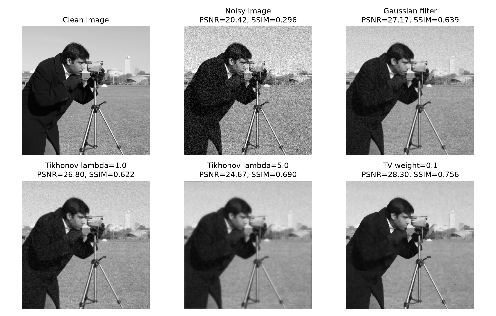

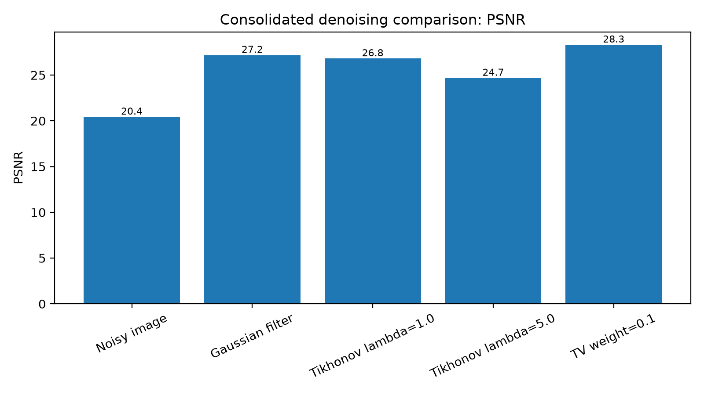

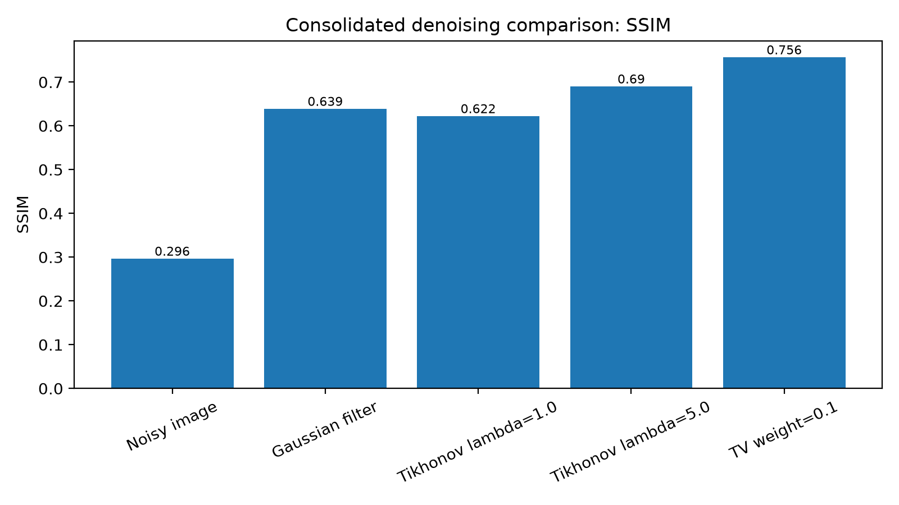

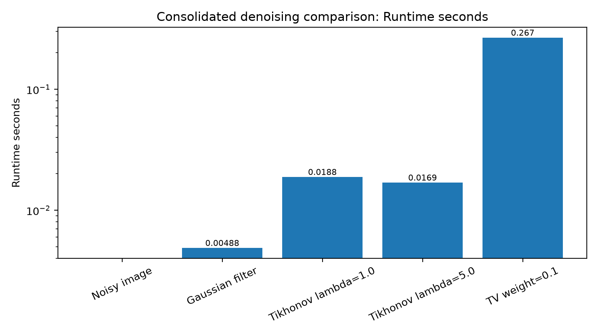

TV denoising is also illustrated visually below.

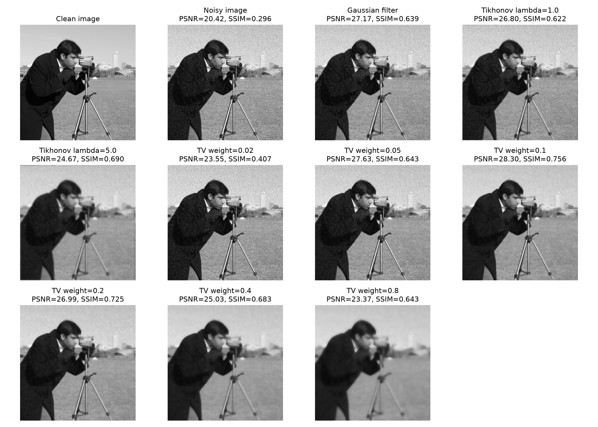

As a Phase 2 robustness check, the main denoising methods were also evaluated
on four built-in `scikit-image` images: `camera`, `coins`, `moon`, and `page`.
The same noise level and method parameters were used for all images. In this
multi-image study, TV Chambolle with `weight = 0.1` achieved the best PSNR and
SSIM on all tested images, while Gaussian filtering remained the fastest
restoration method. This supports the main single-image conclusion while also
showing that Tikhonov `lambda = 5.0` is not uniformly robust across image
types.

Phase 5A adds a Non-local Means denoising baseline on the `camera` image with
`noise_sigma = 0.10`. The full results are saved in
`results/12_nlm_denoising_results.csv`, with visual summaries in
`figures/12_nlm_denoising_psnr.png`,
`figures/12_nlm_denoising_ssim.png`, and
`figures/12_nlm_denoising_visual_grid.png`. The experiment compares NLM
against the noisy image, Gaussian filtering, and TV Chambolle. Among the tested
NLM values, the best PSNR occurs at `h = 0.08` with PSNR `28.815080`, while
the best NLM SSIM occurs at `h = 0.10` with SSIM `0.742657`. NLM improves
clearly over the noisy image and Gaussian filtering. It achieves the highest
PSNR among the tested methods, but TV Chambolle remains best by SSIM with SSIM
`0.756463`. The sensitivity to `h` is also visible: `h = 0.04` is too
conservative and leaves substantial residual noise.

Phase 5B extends the NLM comparison to four images: `camera`, `coins`, `moon`,
and `page`. The full results are saved in
`results/13_multi_image_nlm_denoising_comparison.csv`, with visual summaries in
`figures/13_multi_image_nlm_denoising_psnr_by_method.png`,
`figures/13_multi_image_nlm_denoising_ssim_by_method.png`, and
`figures/13_multi_image_nlm_denoising_visual_grid.png`. The average PSNR/SSIM
values are `20.257347/0.315270` for the noisy image, `26.224359/0.643396` for
Gaussian filtering, `28.667823/0.791593` for TV Chambolle,
`29.073556/0.765391` for NLM `h = 0.08`, and `29.284289/0.792058` for NLM
`h = 0.10`. In this fixed-parameter robustness test, NLM `h = 0.10` gives the
best average PSNR and marginally best average SSIM. TV Chambolle remains highly
competitive and is best on `moon` for both PSNR and SSIM, while Gaussian
filtering remains the fastest restoration method.

### 5.4 Tikhonov Deblurring Results

The deblurring experiment applies Gaussian blur and small Gaussian noise, then solves a Tikhonov deblurring problem over several values of `lambda`.

| Method | Parameter | PSNR | SSIM |
|---|---:|---:|---:|
| Blurred only | - | 25.568595 | 0.750070 |
| Blurred noisy | - | 25.419450 | 0.699460 |
| Tikhonov deblur | lambda = 0.0001 | 20.044275 | 0.242901 |
| Tikhonov deblur | lambda = 0.0005 | 24.731901 | 0.439101 |
| Tikhonov deblur | lambda = 0.001 | 26.158025 | 0.534194 |
| Tikhonov deblur | lambda = 0.005 | 27.684102 | 0.707010 |
| Tikhonov deblur | lambda = 0.01 | 27.757792 | 0.746953 |
| Tikhonov deblur | lambda = 0.05 | 27.244471 | 0.776191 |
| Tikhonov deblur | lambda = 0.1 | 26.839419 | 0.771727 |

The blurred noisy image is worse than the blurred-only image because noise further degrades the observation. Very small `lambda` values produce unstable deblurring: they attempt to invert the blur too aggressively and may amplify noise or ringing artifacts. Moderate `lambda` values improve reconstruction quality. The best PSNR occurs at `lambda = 0.01`, while the best SSIM occurs at `lambda = 0.05`.

This result demonstrates why regularization is important for deblurring. Direct or weakly regularized inversion can be unstable, while a moderate regularization level can improve both pixel-wise and structural reconstruction quality.

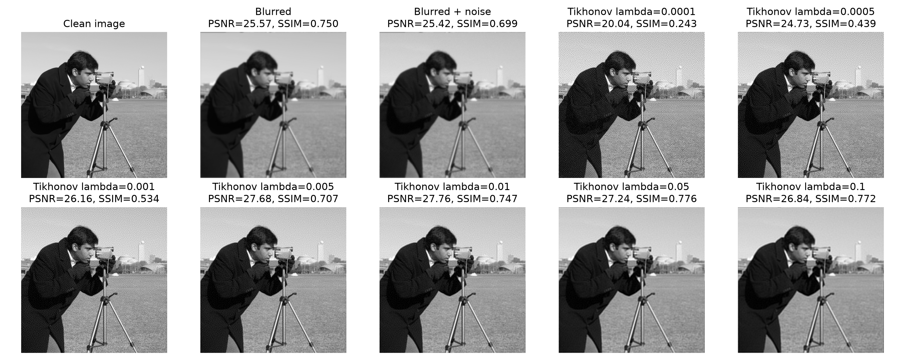

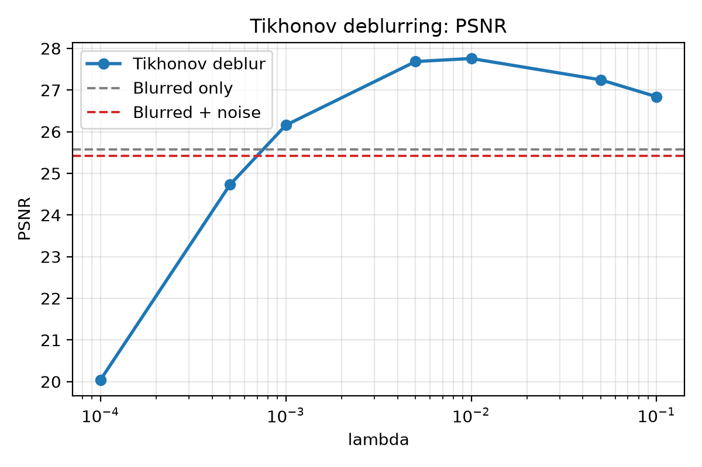

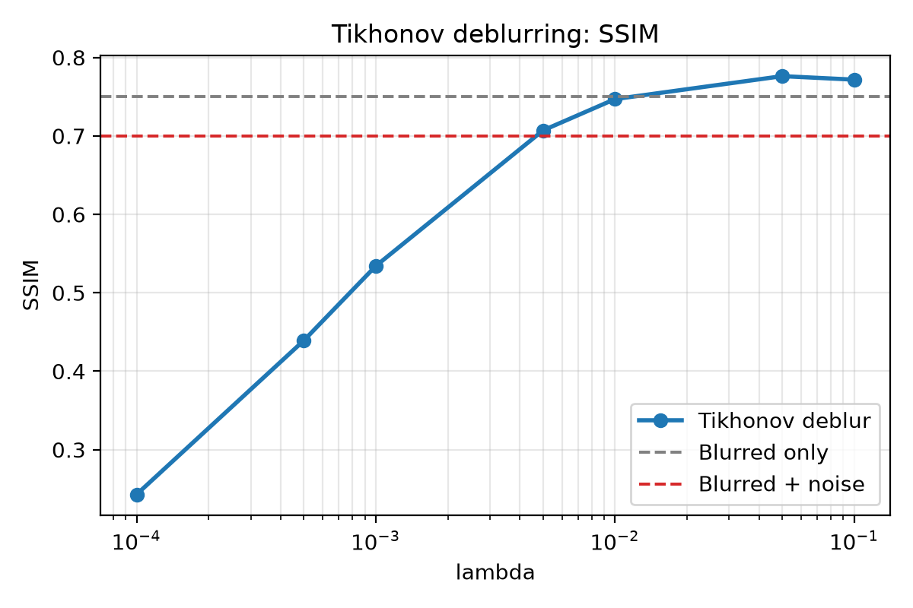

### 5.5 Wiener Deblurring Baseline

Phase 3 adds a Wiener deblurring baseline using the same synthetic Gaussian blur setting as the Tikhonov deblurring experiment. The full result table is saved in `results/10_wiener_deblurring_results.csv`, with visual summaries in `figures/10_wiener_deblurring_psnr.png`, `figures/10_wiener_deblurring_ssim.png`, and `figures/10_wiener_deblurring_visual_grid.png`.

The best Wiener PSNR occurs at `balance = 0.01`, with PSNR `27.629829` and SSIM `0.735582`. The best Wiener SSIM occurs at `balance = 0.03`, with PSNR `26.743149` and SSIM `0.772423`. Both settings improve substantially over the blurred noisy observation, which has PSNR `25.417081` and SSIM `0.698806`. Compared with the selected Tikhonov results, Wiener comes close but does not exceed Tikhonov `lambda = 0.01` in PSNR or Tikhonov `lambda = 0.05` in SSIM. Very small Wiener balance values are unstable in this experiment, while larger values are more conservative.

### 5.6 Multi-image Deblurring Robustness Study

Phase 4 extends the deblurring comparison from the single `camera` image to four built-in `scikit-image` images: `camera`, `coins`, `moon`, and `page`. The full result table is saved in `results/11_multi_image_deblurring_comparison.csv`, with visual summaries in `figures/11_multi_image_deblurring_psnr_by_method.png`, `figures/11_multi_image_deblurring_ssim_by_method.png`, and `figures/11_multi_image_deblurring_visual_grid.png`.

Using fixed parameters from the single-image deblurring study, Tikhonov `lambda = 0.05` gives the highest average PSNR (`27.40`) and average SSIM (`0.762`). Tikhonov `lambda = 0.01` gives average PSNR `27.25` and average SSIM `0.735`. Wiener `balance = 0.01` gives average PSNR `27.04` and average SSIM `0.726`, while Wiener `balance = 0.03` gives average PSNR `26.42` and average SSIM `0.760`. Thus, Wiener remains competitive on some image types and metrics, but Tikhonov is more stable on average in this fixed-parameter robustness study. The results also show that deblurring performance is image-dependent.

### 5.7 Richardson-Lucy Deblurring Baseline

Phase 6 adds a Richardson-Lucy deblurring baseline on the `camera` image. The full results are saved in `results/14_richardson_lucy_deblurring_results.csv`, with visual summaries in `figures/14_richardson_lucy_deblurring_psnr.png`, `figures/14_richardson_lucy_deblurring_ssim.png`, and `figures/14_richardson_lucy_deblurring_visual_grid.png`.

The best Richardson-Lucy PSNR occurs at `num_iter = 5`, with PSNR `23.738545`, SSIM `0.738875`, and runtime `0.093209` seconds. The best Richardson-Lucy SSIM occurs at `num_iter = 10`, with PSNR `22.563644`, SSIM `0.745706`, and runtime `0.177121` seconds. Richardson-Lucy does not improve over the blurred noisy observation in PSNR, since the blurred noisy image has PSNR `25.419450`. However, it does improve over the blurred noisy SSIM value of `0.699460`. The selected Tikhonov and Wiener baselines run in about `0.019` seconds, while Richardson-Lucy runtime increases from `0.093209` seconds at `num_iter = 5` to `0.914123` seconds at `num_iter = 50`. The tested Richardson-Lucy settings do not outperform the best Tikhonov or best Wiener baselines. Increasing the iteration count reduces both PSNR and SSIM after the best range, showing that iterative deconvolution can become sensitive to noise or artifacts.

## 6. Discussion

The experiments show several consistent patterns. First, Gaussian filtering is a strong baseline for additive Gaussian noise. It is easy to implement, very fast, and gives a large improvement over the noisy image. However, because it is a generic smoothing method, it can blur edges and fine structures.

Second, Tikhonov regularization is valuable because it introduces an explicit optimization-based formulation. It makes the trade-off between data fidelity and smoothness mathematically visible. In denoising, Tikhonov did not outperform TV or the best Gaussian filter result in terms of PSNR, but it provided a clear framework for studying regularization parameters. In deblurring, Tikhonov was especially useful because it stabilized an otherwise ill-conditioned inverse problem.

Third, TV denoising achieved the best denoising quality in the tested setting. Its edge-preserving regularization produced the highest PSNR and SSIM among the compared denoising methods. This supports the intuition that an `L1`-type gradient penalty can better preserve edges than the squared-gradient penalty used in Tikhonov regularization. The cost is runtime: TV denoising is slower than both Gaussian filtering and FFT-based Tikhonov denoising.

The multi-image robustness experiment supports the conclusion that TV gives
the best denoising quality in the tested setting, while Gaussian filtering
remains the fastest restoration method.

The NLM experiment adds a complementary denoising perspective. Gaussian
filtering uses local smoothing, Tikhonov and TV use variational regularization,
and NLM uses patch similarity as a non-local image prior. In the single-image
NLM test, this patch-based prior gives the best PSNR among the tested methods,
while TV remains stronger by SSIM. This reinforces that method ranking depends
on the evaluation metric. NLM also has a higher computational cost than the
Gaussian baseline.

The multi-image NLM robustness experiment tests whether the Phase 5A conclusion
transfers beyond the `camera` image. Because the NLM parameters are fixed at
`h = 0.08` and `h = 0.10`, the experiment measures transferability rather than
per-image tuning. In this comparison, NLM remains competitive across all four
images and improves clearly over Gaussian filtering. However, it does not
universally outperform TV on every image. TV remains highly competitive,
especially on `moon`, and the best method depends on image type and evaluation
metric. NLM `h = 0.08` often gives stronger PSNR on individual images, while
`h = 0.10` is better on average and stronger for SSIM. The result strengthens
the robustness dimension of the project while keeping the comparison metric-aware.

A recurring theme is that optimal parameters depend on the chosen metric. In Gaussian filtering, Tikhonov denoising, and Tikhonov deblurring, the parameter that maximized PSNR was not always the parameter that maximized SSIM. This is important because PSNR and SSIM measure different aspects of image quality. A well-designed inverse problem experiment should therefore report multiple metrics and include visual comparisons rather than relying on a single number.

The deblurring experiment also highlights the instability of inverse problems. When `lambda` is too small, the method attempts to invert the blur too aggressively and can amplify noise. When `lambda` is moderate, the method improves both PSNR and SSIM. This illustrates the practical role of regularization in stabilizing inverse problems.

Wiener deconvolution and Tikhonov deblurring are both regularized deblurring methods, but they stabilize the inverse problem in different ways. Tikhonov deblurring uses an explicit optimization objective with smoothness regularization on the image gradient. Wiener deconvolution instead stabilizes inverse filtering directly in the frequency domain through the `balance` parameter.

The Wiener comparison reinforces that deblurring is parameter-sensitive. Aggressive inverse filtering can produce severe artifacts, while overly conservative settings leave blur. This is consistent with the Tikhonov deblurring results and supports the use of multiple metrics and visual inspection.

The multi-image deblurring experiment extends this comparison beyond a single test image. It uses fixed parameters selected from the single-image deblurring study rather than tuning each image separately. This makes the experiment a robustness check: it asks whether settings that work well on `camera` also remain effective for images with different structures.

The Phase 4 results suggest that Tikhonov deblurring is more stable on average for the tested images, while Wiener deconvolution remains competitive for some image-metric combinations. The variation across `camera`, `coins`, `moon`, and `page` reinforces that deblurring performance depends on image structure as well as parameter choice.

Richardson-Lucy complements the earlier deblurring methods by adding an iterative deconvolution mechanism. Tikhonov uses explicit regularization, Wiener uses a frequency-domain stabilized inverse, and Richardson-Lucy repeatedly updates the image estimate to better explain the blurred observation. The experiment shows that deblurring methods differ not only in numerical performance, but also in restoration mechanism and parameter sensitivity.

In the tested setting, Richardson-Lucy improves the structural metric compared with the blurred noisy image, but it does not improve PSNR and does not exceed the selected Tikhonov or Wiener results. Its performance depends strongly on the iteration count: too many iterations reduce both PSNR and SSIM. This behavior is consistent with the general inverse-problem theme that stronger inversion can also amplify noise or artifacts. Richardson-Lucy is therefore a useful iterative baseline, but in this synthetic Gaussian blur plus noise setting it is less stable than the selected Tikhonov and Wiener methods.

## 7. Limitations

This project has several limitations. Although a small multi-image robustness
check was added, only a few standard grayscale test images were used, so the
numerical conclusions may not generalize to broader image types. The FFT-based
solvers use periodic boundary conditions, which are mathematically convenient
but may not match real image boundaries. The blur model is synthetic and uses a
Gaussian kernel rather than real camera or motion blur.

The project also does not include learning-based or deep learning methods. No real-world image dataset was used. TV deblurring was not implemented, and no plug-and-play or learned priors were tested. More images and real-world datasets are still needed to test whether the conclusions generalize. The Wiener experiment is still based on a synthetic Gaussian blur model and a limited set of images. The multi-image deblurring experiment still uses synthetic Gaussian blur and a small set of standard images, so broader datasets and real blur models are needed for stronger conclusions. The experiments therefore should be interpreted as a controlled computational study rather than a comprehensive benchmark.

The NLM experiment is currently limited to a single standard image and a small set of hand-chosen h values.

The multi-image NLM experiment uses only two fixed h values selected from the camera image, so it does not exhaustively tune NLM for each image.

The Richardson-Lucy experiment is currently limited to a single synthetic Gaussian blur setting and a small set of hand-chosen iteration counts.

Future work should test more images, multiple noise and blur settings, alternative boundary conditions, TV deblurring, and simple learning-based baselines. These extensions would help determine whether the observed conclusions remain stable across broader image restoration tasks.

## 8. Conclusion

This project builds a reproducible workflow for studying image inverse problems. It implements denoising and deblurring experiments, compares simple and regularization-based methods, and evaluates reconstruction quality using PSNR, SSIM, runtime, and visual inspection.

For denoising, Gaussian filtering is fast and effective, but TV denoising gives the best reconstruction quality in the tested setting. Tikhonov regularization provides a clear optimization-based model and demonstrates the importance of regularization parameter selection. For deblurring, Tikhonov regularization improves blurred noisy observations but requires careful `lambda` selection to avoid unstable inversion.

Overall, the project demonstrates the value of regularization, parameter sensitivity analysis, and reproducible numerical experiments in image inverse problems. It provides a compact foundation for further study, including more test images, TV deblurring, plug-and-play methods, and learning-based restoration baselines.

## References

[1] A. N. Tikhonov and V. Y. Arsenin, *Solutions of Ill-Posed Problems*. Washington, DC: Winston, 1977.

[2] L. I. Rudin, S. Osher, and E. Fatemi, "Nonlinear total variation based noise removal algorithms," *Physica D: Nonlinear Phenomena*, vol. 60, no. 1-4, pp. 259-268, 1992.

[3] Z. Wang, A. C. Bovik, H. R. Sheikh, and E. P. Simoncelli, "Image quality assessment: From error visibility to structural similarity," *IEEE Transactions on Image Processing*, vol. 13, no. 4, pp. 600-612, 2004.

[4] scikit-image contributors, "scikit-image: Image processing in Python," documentation for `skimage.filters`, `skimage.restoration`, and `skimage.metrics`.

[5] N. Wiener, *Extrapolation, Interpolation, and Smoothing of Stationary Time Series*. To be completed.
